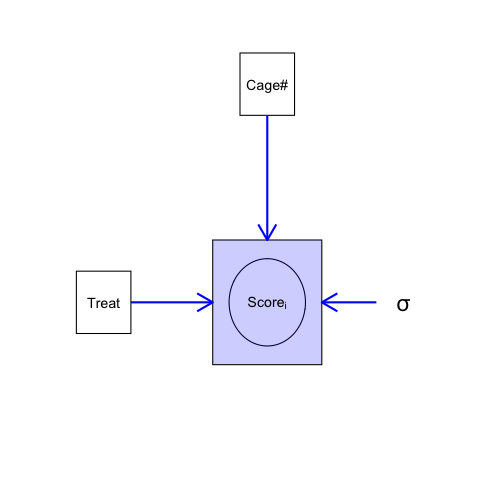
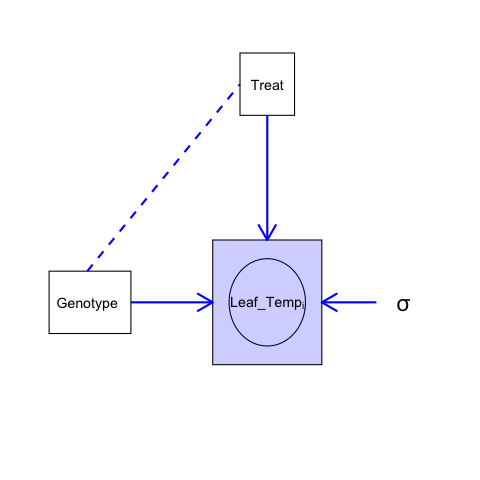
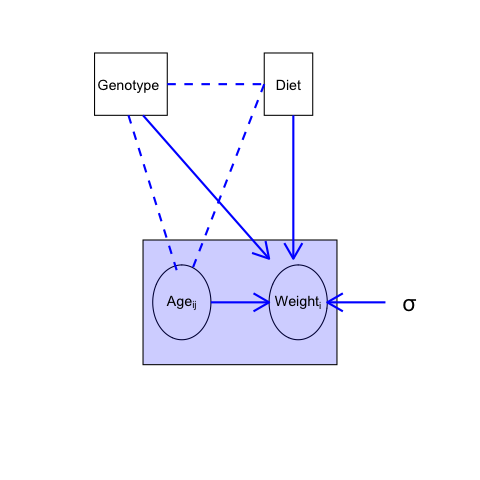

 
## A few key ideas

* Data are a measured response under a set of conditions.
* The measured response is a mixture of "signal" and "noise"
* Noise: measurement error, biological, environmental variation
* Statistical models turn data into information.
 
 
::: block
### The goal of statistical modelling is to partition data into "signal" and "noise" or variation. 

### "Signal" is average treatment effect or an association between sets of variables and outcome.  
:::

 
## What is a Statistical Model?

* An informative summary of data 
* A description of a data generating process
* A mathematical model that includes measures of uncertainty
 
One can fit a model to **explain** outcomes.

One can fit a model to **predict** outcomes.

## A Statistical Model of an Experiment

### Explanatory model
* Statistical model: a conceptualisation of experiment
   * experimental factors - how do they influence outcome?
   * what other things (factors) influence the outcome?
   * Does the outcome have unexplained variation?

## Statistical Models: a principled way to learn from data

* data = signal + noise = mean response + variation
* mean response = f(experimental factors)
* variation = g(other influences) + unexplained variation

::: block
## Experimental design: a principled way to set up experiments to efficiently separate signal and noise.
:::

# Understanding statistical models: examples from Lecture 1

## Example 1: Shigella vaccine challenge experiment

* 6 mice per vaccine group (saline/ low dose / high dose)
* All mice challenged with Shigella bacteria at Day 14
* Outcome: 7-day average symptom score post-challenge

This time, 3 mice per cage (one per treatment), and 6 cages total.

* Potential *factors* influencing score: cage (6) and treatment (3)
* Can estimate *cage effects* (score differences between cages)
* Can estimate *treatment effects* **within** each cage

## Example 1: Shigella vaccine challenge experiment
### Proposed data generating process
```{r echo = FALSE, fig.align='center'}

```

## Example 2: Drought resistance in GM tomato plants 

* Genotypes: WT or mutant
* watering conditions: normal or drought
* Outcome: leaf temperature at 7 days post-treatment

* Potential *factors* influencing temperature: genotype (2) and water (2)
* Estimate *treatment effect* within each genotype
* Do treatment effects differ by genotype? 

## Example 2: Drought resistance in GM tomato plants 
### Proposed data generating process
```{r echo=FALSE, fig.align = 'center'}

```

## Example 3: Diet and obesity
### Are NODk mice more susceptible to obesity with a high fat diet?

```{r echo = FALSE}
library(ggplot2)
mice<- read.csv("../Data/diet and diabetic mice.csv")
ggplot(mice, aes(x=Age, y=Wt, group = MouseID, colour=Diet))+
  geom_point()+
  geom_line()+
  facet_wrap(~Strain)+
  theme_classic()
```

## Example 3: Diet and obesity
### Are NODk mice more susceptible to obesity with a high fat diet?

* Genotypes: WT or NODk
* Diet: normal or high fat
* Age: measured over time

::: block
## Does diet impact *growth*? Does diet have stronger impact on growth in NODk mice?
:::

## Example 3: Diet and obesity
```{r echo=FALSE, fig.align = 'center'}

```
## Summary

* Statistical models: conceptualisation of experiment
* 

:::block
### In the next workshop, we'll fit models to data using R
:::